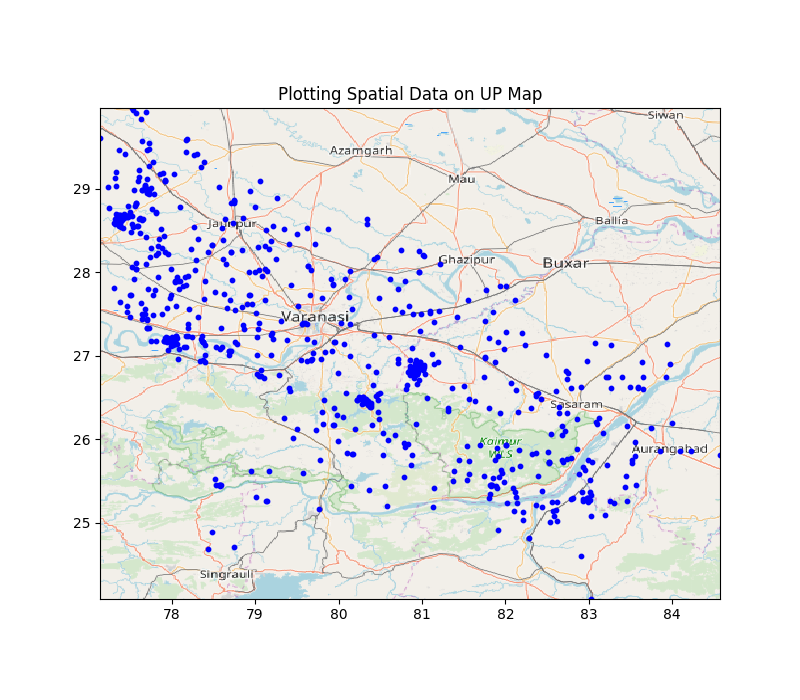

# UP100
## Updates regarding project

### Updates on 3rd Mar, 2020:
  1. Below is the movement of the agents in the gridworld using Kanpur Data:
  
  2. The trajectory of the agents for one day can be found in Result folder. The location is provided for every hour.

### Updates on 24th Feb, 2020:
  1. Below is the crime plotted in entire UP
  
  2. Crime scene plot for each district can be found in ./Figure/2020-02-24 folder.

